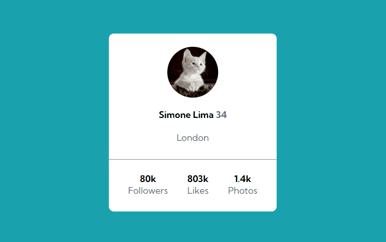

# Projeto Frontend Mentor | Profile card component
Atividade para as competências de Flex-container e Flex-item.🎁 

## Experiência

Para layouts incríveis, o correto posicionamento dos flex-container e flex-item
é imprescindível, pois é por meio deles que nossas caixas mágicas apresentarão
um projeto final visualmente agradável e de uso intuitivo. Nesse sentido, de forma
genérica, para centralizar a caixa-mágica desse projeto de modo que todas as
propriedades de alinhamento funcionassem de imediato, a declaração das dimensões,
como width e height, utilizando as unidades de medidas mais apropriadas para
cada caixa e tamanho de telas diferentes, foi o que viabilizou a centralização dos elementos.

[]

## Tecnologias utilizadas
-HTML
-CSS
